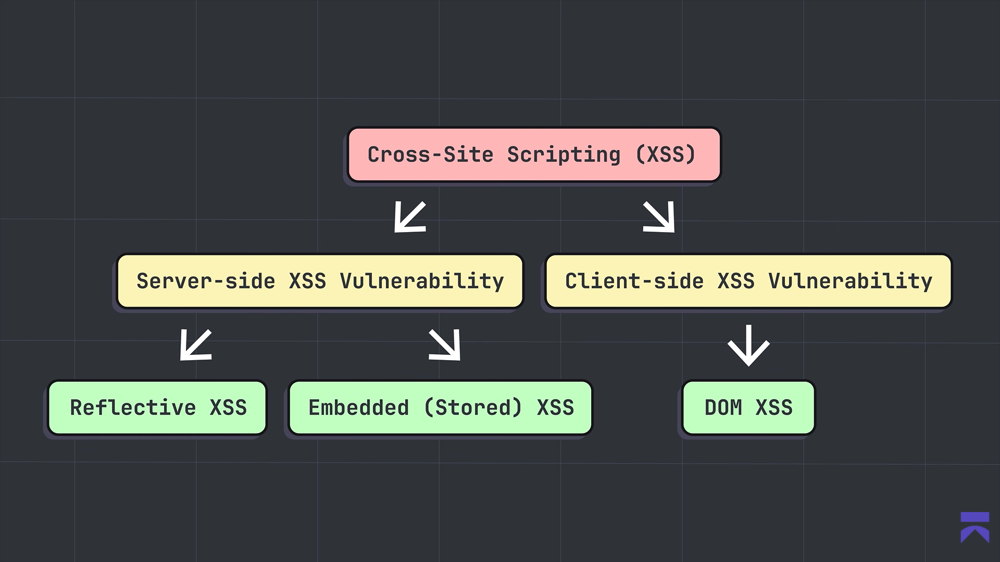

resources: 

yt:
- https://youtu.be/cTJykfSLlkU
- [xss playlist](https://youtube.com/playlist?list=PLVLbIIcGrsT7JLzxjD8lvAmR_OSFQwrxg&si=kbrsZvp1-4nW57eM)
- [defronix academy](https://www.youtube.com/live/tZKF0LnPVsA?si=hQrN4RqdedU2zkut)
- [advanced](https://youtu.be/0GxLc2vsQVg)
- 
## What is XSS?

**Cross-Site Scripting (XSS)** is a web application vulnerability in which an attacker causes a website to execute untrusted JavaScript in another user’s browser. It usually happens when an application places user-controlled input into a page without correctly validating or encoding it.[[owasp](https://owasp.org/www-community/attacks/xss)]

The script runs in the security context of the vulnerable website, so it may be able to perform actions as the victim, read accessible page data, or modify what the victim sees. The exact impact depends on the application’s protections and the victim’s privileges.[[portswigger](https://portswigger.net/web-security/cross-site-scripting)]

## Main types of XSS

|Type|How it works|Typical example|
|---|---|---|
|**Reflected XSS**|Malicious input comes from the current HTTP request and is immediately reflected in the server’s response.|A vulnerable search or error page displays a value from a URL parameter without safe encoding.|
|**Stored XSS**|Malicious input is saved by the application—such as in a database—and later delivered to other users.|A comment, profile field, or forum post contains unsafe script content.|
|**DOM-based XSS**|Client-side JavaScript reads attacker-controlled data and writes it into the page through an unsafe DOM operation. The server response itself may not change.|JavaScript reads a URL fragment and inserts it using an unsafe HTML-rendering method.|



| Type              | Stored where?            | Requires victim interaction?         | Common location          |
| ----------------- | ------------------------ | ------------------------------------ | ------------------------ |
| **Reflected XSS** | Usually request/response | Usually yes                          | URL parameters, search   |
| **Stored XSS**    | Server/database          | No, after victim views affected page | Comments, profiles       |
| **DOM-based XSS** | Client-side DOM          | Usually yes                          | JavaScript/URL fragments |
These three categories are the commonly recognized types.[[portswigger](https://portswigger.net/web-security/cross-site-scripting)][[owasp](https://owasp.org/www-community/Types_of_Cross-Site_Scripting)]

### 1. Reflected XSS

The payload is included in a request, such as a query parameter, and the server reflects it into the response immediately. It is usually delivered through a crafted link, so the victim generally has to open or submit the malicious request.

**Flow:**

```
Attacker-controlled request
        ↓
Server reflects input into HTML
        ↓
Victim’s browser executes it
```

### 2. Stored XSS

The payload is stored on the server and executed whenever users load the affected page. It is often more serious because one successful submission can affect multiple visitors.

Common storage locations include:

- Comments and forum posts.
- Usernames or profile fields.
- Support tickets.
- Messages.
- Product reviews.

### 3. DOM-based XSS

The vulnerability is primarily in browser-side JavaScript. The script takes data from a source, such as the URL, and places it into a dangerous sink without appropriate handling. OWASP describes this as modifying the DOM environment so that client-side code behaves unexpectedly.[[owasp](https://owasp.org/www-community/Types_of_Cross-Site_Scripting)]

Examples of risky sinks can include:

- `innerHTML`
- `outerHTML`
- `document.write()`
- Certain unsafe uses of `eval()`

## How to prevent XSS

- Use **context-aware output encoding** whenever displaying user-controlled data.
- Prefer safe DOM APIs such as `textContent` instead of inserting untrusted HTML.
- Validate input where appropriate, but do not rely on input validation alone.
- Use a carefully configured **Content Security Policy (CSP)** as an additional layer.
- Set cookies with `HttpOnly`, `Secure`, and appropriate `SameSite` attributes.
- Use trusted framework templating features and avoid disabling automatic escaping.
- Test both server-side responses and client-side JavaScript for unsafe data flows.

A useful beginner distinction is:

> **Reflected:** comes from the request.  
> **Stored:** comes from server-side storage.  
> **DOM-based:** comes from unsafe client-side JavaScript.