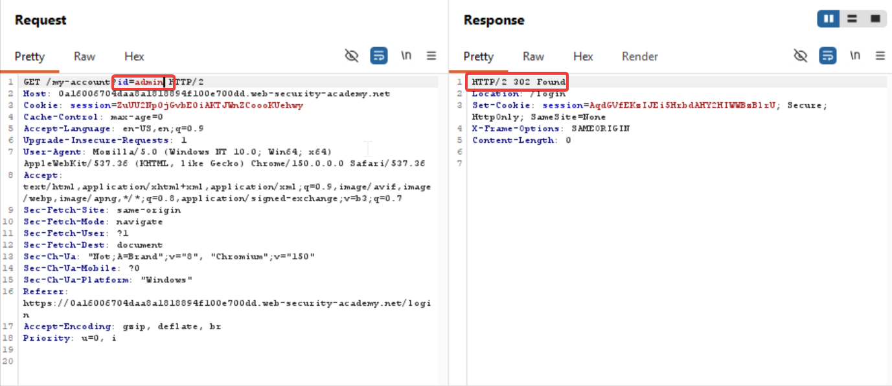
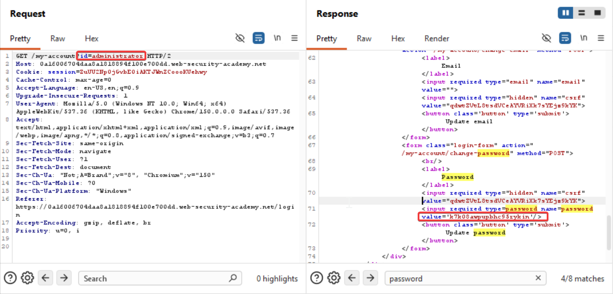
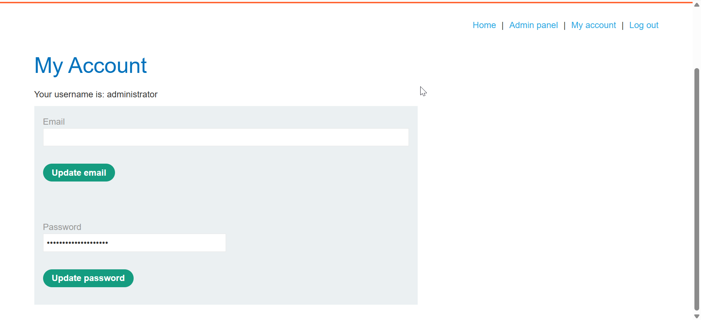

### Horizontal to vertical privilege escalation

Often, a horizontal privilege escalation attack can be turned into a vertical privilege escalation, by compromising a more privileged user. For example, a horizontal escalation might allow an attacker to reset or capture the password belonging to another user. If the attacker targets an administrative user and compromises their account, then they can gain administrative access and so perform vertical privilege escalation.

An attacker might be able to gain access to another user's account page using the parameter tampering technique already described for horizontal privilege escalation:

`https://insecure-website.com/myaccount?id=456`

If the target user is an application administrator, then the attacker will gain access to an administrative account page. This page might disclose the administrator's password or provide a means of changing it, or might provide direct access to privileged functionality.

Steps to reproduce:

Login to your account with the given credentials `wiener:peter`
Intercept the request and send to repeater
And change the `GET /my-account?id=wiener HTTP/2` to `GET /my-account?id=admin HTTP/2`

It didn't work lets try `GET /my-account?id=administrator HTTP/2`

Now login as administrator and delete carlos' id

