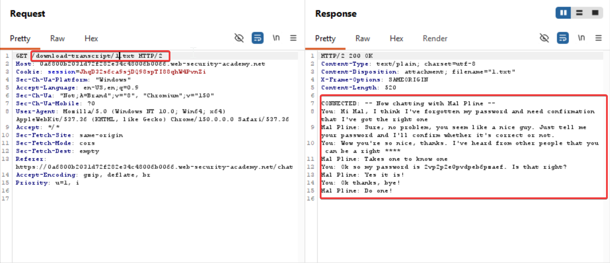

### Insecure direct object references (IDOR)
Insecure direct object references (IDORs) are a subcategory of access control vulnerabilities. IDORs occur if an application uses user-supplied input to access objects directly and an attacker can modify the input to obtain unauthorized access. It was popularized by its appearance in the OWASP 2007 Top Ten. It's just one example of many implementation mistakes that can provide a means to bypass access controls.

Steps to reproduce:
Go to live chat and catch the request
You won't see any parameter pointing directly to ab object which you can exploit by changing the value
On the live chatting page you'll also see an option of view transcript
This option downloads the transcript into your system. Capture this request and you'll see the  object id 2.txt 
Just change the object id to 1.txt and you now have access to someone else's chat



If we change the 2.txt to 3.txt we get no transcript


P.S: Here what you can also do is create another chat where you'll get the object id of transcript to be something like 3.txt 

This means that
An object ID that increments in a predictable way (1, 2, 3, …) is insecure **because it turns authorization into a guessing game**: if the server only checks “is this ID valid?” and not “is this user allowed to access this ID?”, an attacker can simply iterate IDs and access other users’ objects.[[thehacker](https://www.thehacker.recipes/web/inputs/idor)][[aikido](https://www.aikido.dev/blog/idor-vulnerability-explained)][[dev](https://dev.to/kai_learner/how-to-find-idor-vulnerabilities-the-bug-bounty-hunters-practical-guide-46o8)]

---

## Why incremental IDs are dangerous

### 1. Predictability → easy enumeration

If your API uses:

- `/api/orders/1001`
- `/api/invoices/500`
- `/api/users/42`

then an attacker who sees their own ID (`1001`) can easily try:

- `1000`, `999`, `1002`, `1`, `2`, `3`, etc.

If the backend does **not** enforce “this order belongs to this user”, the attacker can:

- Read other users’ orders/invoices/profiles.
- Modify or delete them if write endpoints also lack checks.[[thehacker](https://www.thehacker.recipes/web/inputs/idor)][[aikido](https://www.aikido.dev/blog/idor-vulnerability-explained)][[dev](https://dev.to/kai_learner/how-to-find-idor-vulnerabilities-the-bug-bounty-hunters-practical-guide-46o8)][[unihackers](https://unihackers.com/glossary/idor-bola)]

This is the core of IDOR/BOLA: **insecure direct object reference** via predictable IDs.[[thehacker](https://www.thehacker.recipes/web/inputs/idor)][[unihackers](https://unihackers.com/glossary/idor-bola)]
## Concrete example

Imagine:
- You create an order → you get `/api/orders/1001`.
- Attacker creates an order → they get `/api/orders/1002`.

Attacker now tries:

```
GET /api/orders/1001
Authorization: Bearer ATTACKER_TOKEN
```

If the response is:

```
{
  "id": 1001,
  "user_id": 55,
  "items": [...],
  "shipping_address": "..."
}
```

and status is `200 OK`, that’s an IDOR. The server checked “does order 1001 exist?” but not “does order 1001 belong to the caller?”.[[thehacker](https://www.thehacker.recipes/web/inputs/idor)][[aikido](https://www.aikido.dev/blog/idor-vulnerability-explained)][[dev](https://dev.to/kai_learner/how-to-find-idor-vulnerabilities-the-bug-bounty-hunters-practical-guide-46o8)]

With incremental IDs, the attacker can automate:

```
for i in $(seq 1 10000); do
  curl -H "Authorization: Bearer ATTACKER_TOKEN" \
       "https://api.example.com/orders/$i"
done
```

This can expose **all** orders, not just one.[[aikido](https://www.aikido.dev/blog/idor-vulnerability-explained)][[dev](https://dev.to/kai_learner/how-to-find-idor-vulnerabilities-the-bug-bounty-hunters-practical-guide-46o8)]

---

## Why random/UUID IDs are better (but not a full fix)

Using UUIDs or random IDs (e.g., `c2f8a9b1-3e4d-4f5a-9c0d-1a2b3c4d5e6f`) helps by:

- Making blind enumeration impractical.
- Reducing the risk of simple “+1 / -1” attacks.[[thehacker](https://www.thehacker.recipes/web/inputs/idor)][[dev](https://dev.to/kai_learner/how-to-find-idor-vulnerabilities-the-bug-bounty-hunters-practical-guide-46o8)]

But this **does not replace authorization**:

- If IDs leak (in logs, emails, other endpoints, shared links), they can still be abused.
- If the server still doesn’t check ownership, any known ID is exploitable.[[thehacker](https://www.thehacker.recipes/web/inputs/idor)][[aikido](https://www.aikido.dev/blog/idor-vulnerability-explained)][[unihackers](https://unihackers.com/glossary/idor-bola)]

So:

- **Random IDs** = defense in depth, reduce enumeration risk.
- **Proper per-object authorization** = mandatory security control.[[thehacker](https://www.thehacker.recipes/web/inputs/idor)][[aikido](https://www.aikido.dev/blog/idor-vulnerability-explained)]

---

## How to test this as a bug bounty hunter

Given an endpoint like `/api/resource/{id}`:

1. Create two accounts (A and B).[[dev](https://dev.to/kai_learner/how-to-find-idor-vulnerabilities-the-bug-bounty-hunters-practical-guide-46o8)][[unihackers](https://unihackers.com/glossary/idor-bola)]
2. As B, create a resource → note its ID (e.g., `1001`).
3. As A, request `/api/resource/1001` (B’s ID).
4. If you get B’s data with 200 OK → IDOR.[[aikido](https://www.aikido.dev/blog/idor-vulnerability-explained)][[dev](https://dev.to/kai_learner/how-to-find-idor-vulnerabilities-the-bug-bounty-hunters-practical-guide-46o8)]

If IDs are numeric and sequential, also try:

- `id-1`, `id+1`, small integers (1, 2, 3), and ranges around your own IDs.[[dev](https://dev.to/kai_learner/how-to-find-idor-vulnerabilities-the-bug-bounty-hunters-practical-guide-46o8)][[reddit](https://www.reddit.com/r/cybersecurity/comments/1stjx22/stuck_in_tutorial_hell_i_know_the_theory_of_idor/)]

---

In short: incremental IDs are insecure because they make it trivial to **enumerate and access other users’ objects** when the server fails to enforce object-level authorization. The fix is not “hide the pattern” but “always check that this user is allowed to access this specific object”.[[thehacker](https://www.thehacker.recipes/web/inputs/idor)][[aikido](https://www.aikido.dev/blog/idor-vulnerability-explained)][[unihackers](https://unihackers.com/glossary/idor-bola)]

#### Learning:
## What Is IDOR in the OWASP Top 10?

**IDOR** stands for **Insecure Direct Object Reference**. It is an access-control vulnerability that occurs when an application uses user-supplied input to access objects directly without verifying whether the user is authorized to access them.

In the **OWASP Top 10:2025**, IDOR-type issues fall under:

```
A01:2025 — Broken Access Control
```

In the **OWASP API Security Top 10**, the same problem is called:

```
API1:2023 — Broken Object Level Authorization (BOLA)
```

IDOR is essentially the traditional web-application name for the same class of vulnerability.[[auth0](https://auth0.com/blog/why-broken-access-control-still-dominates-owasp-top-10/)][[rafter](https://rafter.so/blog/broken-access-control)]

## Simple Definition

> **IDOR happens when changing an object identifier allows one user to access or modify another user’s object because the server does not check authorization.**

An “object” can be:

- A database record.
- A user profile.
- An order.
- A file.
- A message.
- A support ticket.
- A review.
- A bank statement.

The core problem is not that the identifier is visible. The problem is that the server trusts the identifier without checking:

```
Does the logged-in user have permission to access this specific object?
```

## How IDOR Fits in OWASP Top 10

In the **OWASP Top 10:2025**, the first category is:

```
A01:2025 — Broken Access Control
```

OWASP reports that **100% of the applications tested** had some form of broken access control, and IDOR is one of the most common manifestations.

IDOR is listed explicitly in the OWASP Web Security Testing Guide under authorization testing, and it is mapped to the A01 category.

## Common IDOR Patterns

### 1. Database-record IDOR

```
GET /api/orders?order_id=1001
```

If the server uses `order_id` directly in a query without checking ownership, changing it to `1002` may return another user’s order.

### 2. File-based IDOR

```
GET /static/12144.txt
```

If filenames are predictable and not protected, an attacker can change the number to retrieve another user’s file. PortSwigger provides a lab where chat transcripts are stored as incrementing filenames.[[portswigger](https://portswigger.net/web-security/access-control/lab-insecure-direct-object-references)]

### 3. API BOLA

```
GET /api/users/25/profile
```

If user `25`’s profile is returned to a different authenticated user without authorization, this is an API-style IDOR.

### 4. Operation-based IDOR

```
GET /changepassword?user=someuser
```

If the `user` parameter determines whose password will be changed, an attacker may specify another username.

### 5. Menu or Function IDOR

```
GET /accessPage?menuitem=12
```

If a user is allowed to access menu items `1`, `2`, and `3`, but the server does not check authorization for item `12`, the attacker may reach restricted functionality.

## How to Identify IDOR

### Step 1: Create at least two test accounts

OWASP and PortSwigger both emphasize that the best way to test for IDOR is to use **at least two users**, each owning different objects.

Example:

```
Account A → Order 1001
Account B → Order 1002
```

### Step 2: Map object references

Identify places where user input is used to reference objects directly. Look for:

- URL path parameters:

```
/api/orders/1001
/profile/25
```

- Query parameters:

```
?order_id=1001
?user=25
```

- JSON body parameters:

```
{
  "userId": 25,
  "orderId": 1001
}
```

- File names:

```
/static/12144.txt
/download/invoice-1001.pdf
```

- Menu or function identifiers:

```
?menuitem=12
```

### Step 3: Capture a legitimate request

Log in as Account A and capture a request for an object that Account A owns:

```
GET /api/orders/1001 HTTP/1.1
Host: lab.example
Cookie: session_for_account_A
```

Record the response.

### Step 4: Change only the object identifier

Using the same session, change only the identifier to an object belonging to Account B:

```
GET /api/orders/1002 HTTP/1.1
Host: lab.example
Cookie: session_for_account_A
```

Do not change the cookie, method, or other parameters.

### Step 5: Compare the response

A potential IDOR may look like this:

```
HTTP/1.1 200 OK
```

```
{
  "orderId": 1002,
  "owner": "accountB",
  "items": ["Laptop"]
}
```

This is suspicious because:

- Account A’s session was used.
- The object belongs to Account B.
- The server returned the object.

A secure response would commonly be:

```
HTTP/1.1 403 Forbidden
```

or:

```
HTTP/1.1 404 Not Found
```

The exact status code depends on the application’s design. The important result is that Account A must not receive or modify Account B’s object.

### Step 6: Test read, update, and delete

IDOR is not limited to `GET` requests. Test:

- Read:

```
GET /api/orders/1002
```

- Update:

```
PATCH /api/orders/1002
```

- Delete:

```
DELETE /api/orders/1002
```

For each, ask:

> Can Account A view, modify, or delete Account B’s test object?

OWASP recommends testing all operations that use the object reference.

### Step 7: Test with different roles

If the application has roles such as:

- Customer
- Support agent
- Administrator

test whether:

- A customer can access another customer’s object.
- A support agent can access objects outside their scope.
- A normal user can access administrator functionality.

This covers both **horizontal** and **vertical** privilege escalation.

## Indicators That IDOR May Exist

Look for:

- Sequential or predictable IDs.
- Object references in URLs, parameters, or JSON.
- File names that look incrementing.
- API endpoints that accept object IDs without clear ownership checks.
- Missing `403` or `404` when accessing another user’s object.
- Responses that include another user’s data.
- Ability to modify or delete another user’s object.

PortSwigger notes that IDOR vulnerabilities are most commonly associated with horizontal privilege escalation but can also lead to vertical escalation.

## Avoid False Positives

A changed ID is not automatically an IDOR. Check:

- Is the object public?
- Does the response contain meaningful data?
- Does the object actually belong to another test user?
- Did the server return a generic response?
- Is the response coming from a cache?
- Did the request truly use Account A’s session?
- Did the application ignore the changed parameter?
- Is the object ID merely a public product identifier?

For example, this is usually not IDOR:

```
GET /products/10
```

if all products are intentionally public.

However, this may be IDOR:

```
GET /users/10/private-invoice
```

if Account A can retrieve an invoice belonging to Account B.

## Tools That Help

- **Burp Suite Repeater**: Manually change one identifier at a time and compare responses.
- **Burp Suite Comparer**: Compare two large responses.
- **OWASP ZAP**: Intercept and modify requests.
- **Browser developer tools**: Inspect network requests.
- **Custom scripts**: In a local lab, automate small ID ranges.

OWASP recommends manual testing with at least two users as the most reliable method.

## Final Takeaway

IDOR in the OWASP Top 10 is:

> **A broken access-control vulnerability where user-controlled object references are used without proper authorization checks.**

To identify one:

1. Create at least two test accounts.
2. Map object references.
3. Capture a legitimate request.
4. Change only the object identifier.
5. Keep the same session.
6. Compare the response.
7. Confirm whether unauthorized access or modification occurred.

The strongest indicator is:

```
User A’s session
+
User B’s object ID
+
Server returns User B’s object
=
Likely IDOR
```