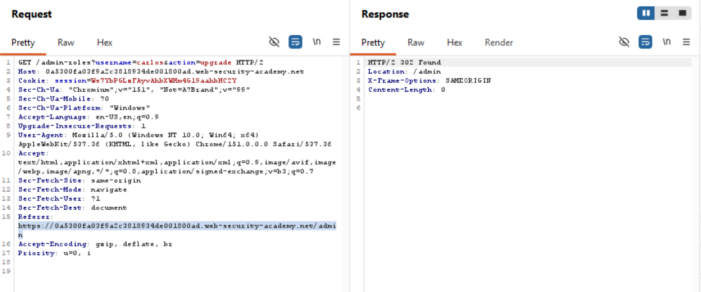
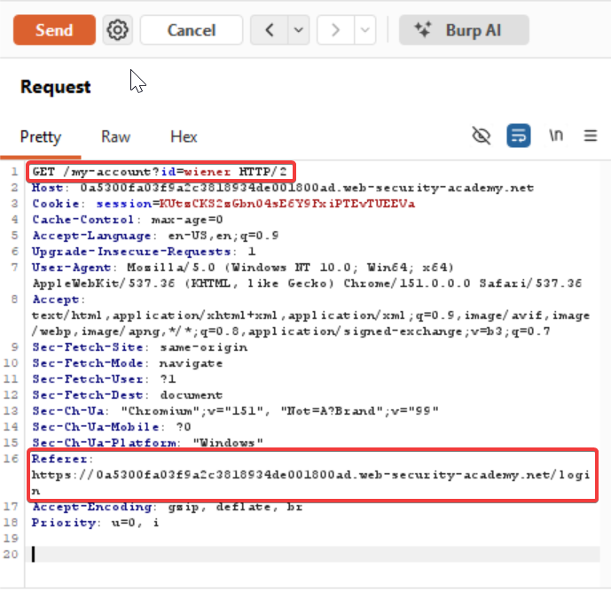
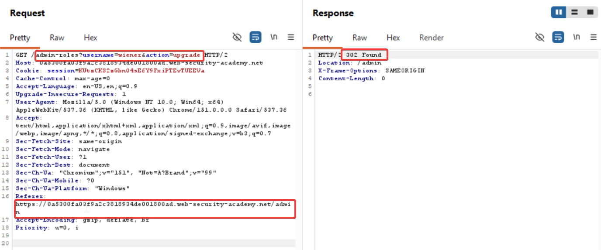

### Referer-based access control

Some websites base access controls on the `Referer` header submitted in the HTTP request. The `Referer` header can be added to requests by browsers to indicate which page initiated a request.

For example, an application robustly enforces access control over the main administrative page at `/admin`, but for sub-pages such as `/admin/deleteUser` only inspects the `Referer` header. If the `Referer` header contains the main `/admin` URL, then the request is allowed.

In this case, the `Referer` header can be fully controlled by an attacker. This means that they can forge direct requests to sensitive sub-pages by supplying the required `Referer` header, and gain unauthorized access.

Steps to reproduce:

Login as administrator
Upgrade user `carlos` to admin and capture it's request



Now logout and login with the given credentials `wiener:peter` and capture this request and send it to repeater



Now since this lab contains referer based error. You simply copy and **replace wiener's session** header with the referer header from the `promoting carlos to admin` request, which looks like

```
https://0a5300fa03f9a2c3818934de001800ad.web-security-academy.net/admin
```

And also change the http method header for promotion
Send it and boom !!!



Access control labs solved
#### Learnings:

In HTTP, the **`Referer` header** tells the server **which page the browser was on just before it made the current request**.[[hackerone](https://hackerone.com/eternal)][[acunetix](https://www.acunetix.com/blog/web-security-zone/what-are-insecure-direct-object-references/)]

### Simple example

You’re on:

`https://example.com/blog/post-1`

You click a link to:

`https://example.com/blog/post-2`

The browser sends a request for `post-2` with a header like:

```
Referer: https://example.com/blog/post-1
```

This means: “The user came to this page from `post-1` on the same site.”[[hackerone](https://hackerone.com/eternal)][[acunetix](https://www.acunetix.com/blog/web-security-zone/what-are-insecure-direct-object-references/)]

If you click a link from:

`https://google.com/search?q=example`

to

`https://example.com/`

the request to `example.com` might include:

```
Referer: https://www.google.com/search?q=example
```

## Why it matters for security (especially for you as a bug bounty / appsec learner)

The `Referer` header is often used (sometimes poorly) for:

- **Access control checks**  
    Some apps try to block “direct” access to a page by checking if the `Referer` is from their own domain.  
    Example (bad idea):
    
    ```
    if "myapp.com" not in request.headers.get("Referer", ""):
        return 403
    ```
    
    This is weak because:
    
    - Attackers can **spoof** the `Referer` header in tools like Burp, curl, or custom scripts.
    - Many browsers or extensions may **omit** the `Referer` for privacy.  
        So you should never rely on `Referer` for security.[[thehacker](https://www.thehacker.recipes/web/inputs/idor)]
- **CSRF protections (also weak if used alone)**  
    Old or badly designed apps sometimes check `Referer` or `Origin` to try to prevent cross-site request forgery. Proper CSRF defense uses **tokens**, not just headers.[[thehacker](https://www.thehacker.recipes/web/inputs/idor)]
- **Logging and analytics**  
    Sites use `Referer` to know:
    
    - Which site sent traffic (Google, Twitter, etc.).
    - Which internal page the user navigated from.  
        This is its main legitimate use today.[[hackerone](https://hackerone.com/eternal)][[acunetix](https://www.acunetix.com/blog/web-security-zone/what-are-insecure-direct-object-references/)]

## How you’ll see it in Burp Suite

In Burp’s HTTP history, a request might show:

```
GET /dashboard HTTP/1.1
Host: app.example.com
User-Agent: Mozilla/5.0 ...
Referer: https://app.example.com/login
Cookie: session=abc123
```

That tells you the user reached `/dashboard` from `/login` on the same site.

When testing for IDOR, CSRF, or access control issues, you might:

- Remove the `Referer` header.
- Change it to another domain.
- See if the application behaves differently (e.g., allows/blocks the request).  
    If behavior changes based only on `Referer`, that’s usually a **design flaw**, not strong security.[[thehacker](https://www.thehacker.recipes/web/inputs/idor)]

