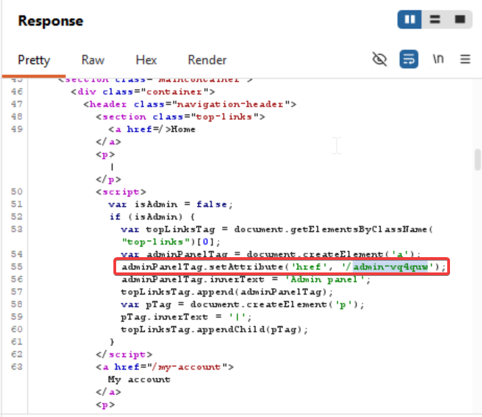
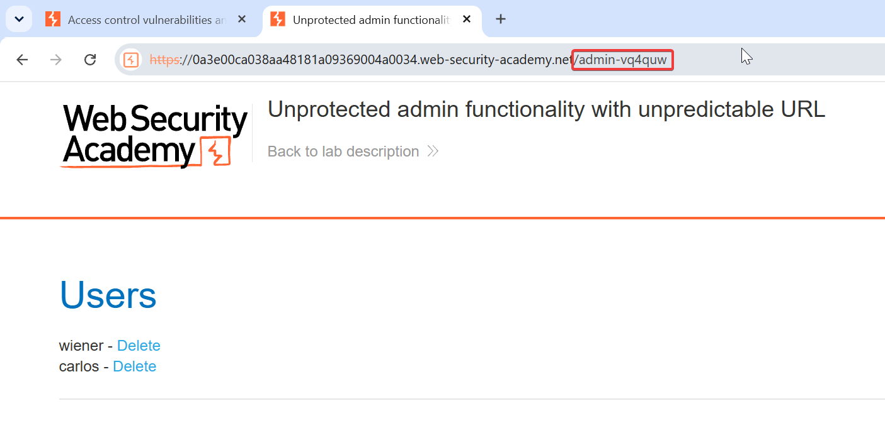

In some cases, sensitive functionality is concealed by giving it a less predictable URL. This is an example of so-called "security by obscurity". However, hiding sensitive functionality does not provide effective access control because users might discover the obfuscated URL in a number of ways.

eg- https://insecure-website.com/administrator-panel-yb556

Captured the home page request and sent it to repeater.
And went through the response and found the unique admin url
Pasted it in the browser and got the admin panel access

