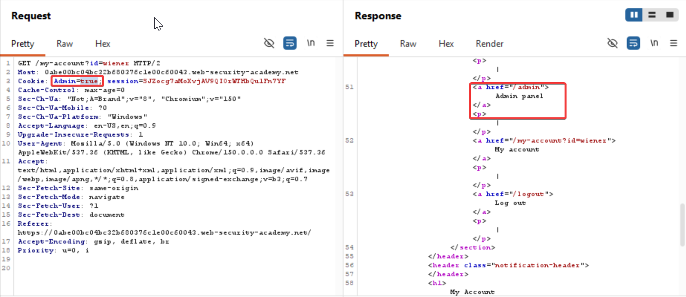
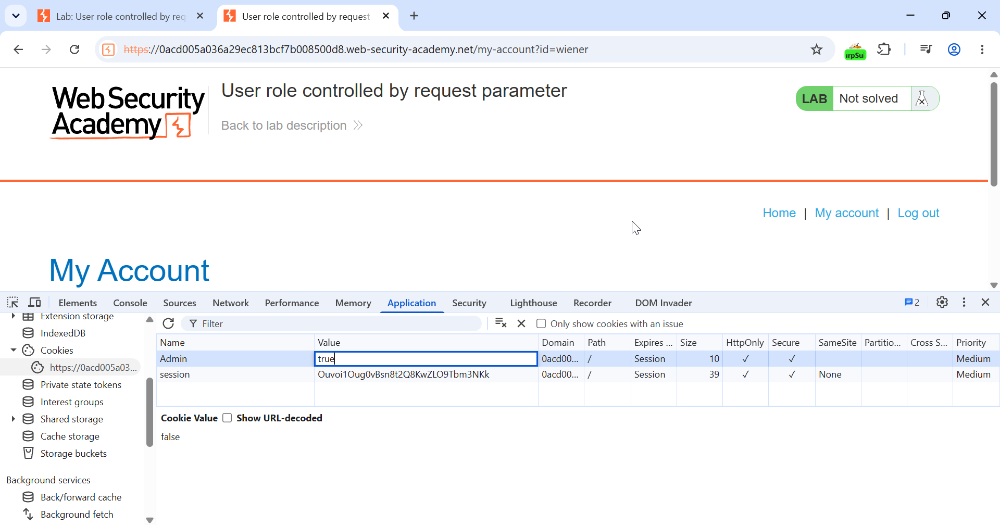

Parameter Based Access Control Methods

Some applications determine the user's access rights or role at login, and then store this information in a user-controllable location. This could be:

- A hidden field.
- A cookie.
- A preset query string parameter.

The application makes access control decisions based on the submitted value. For example:

`https://insecure-website.com/login/home.jsp?admin=true https://insecure-website.com/login/home.jsp?role=1`

This approach is insecure because a user can modify the value and access functionality they're not authorized to, such as administrative functions.

Steps to Recreate:

Captured the login request and sent it to repeater
Then changed the value in cookie parameter 
`Admin=false` to `Admin=true` and sent the response 
`Cookie: Admin=true; session=SJZocg7aMoXvjAV9QIOrWTHbQu1Fn7YF`

Now the admin panel was visible in the response code so copy the request url and open it in different tab

==Note: If you copy the response url you'll only get the admin panel ui but wont get directed to the admin panel==

Or we could do this way as well

