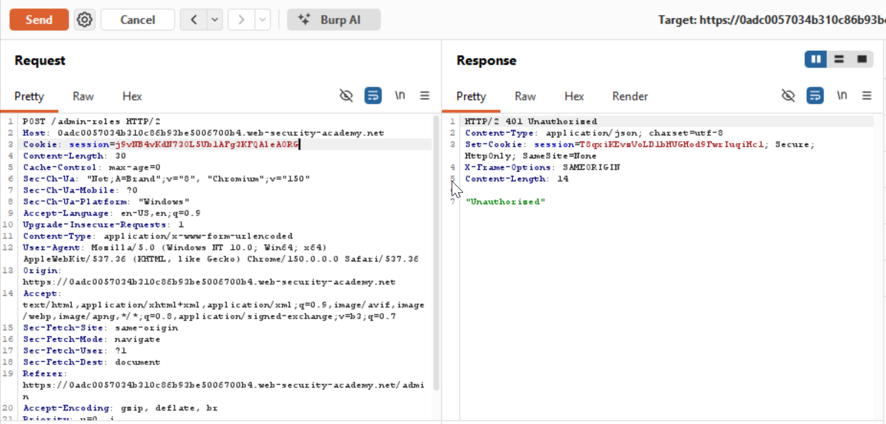
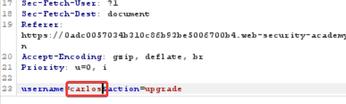
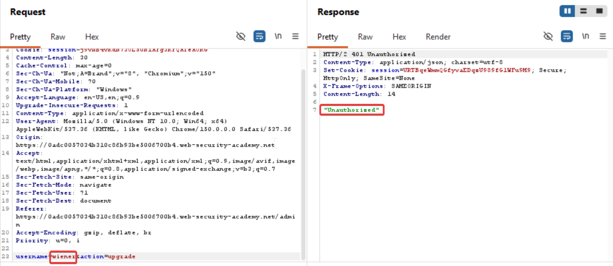
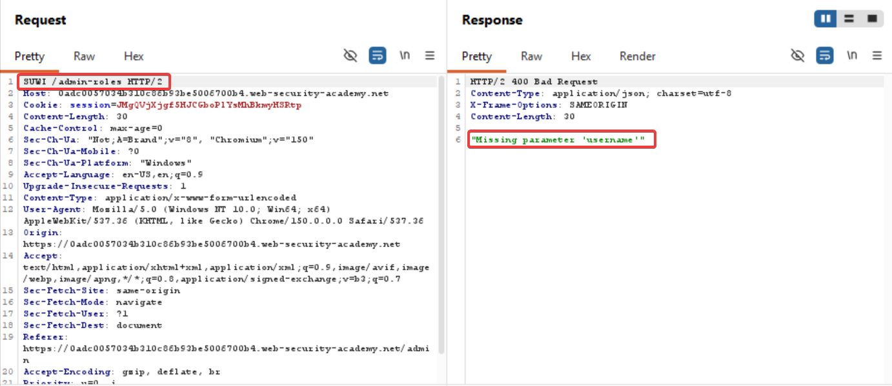
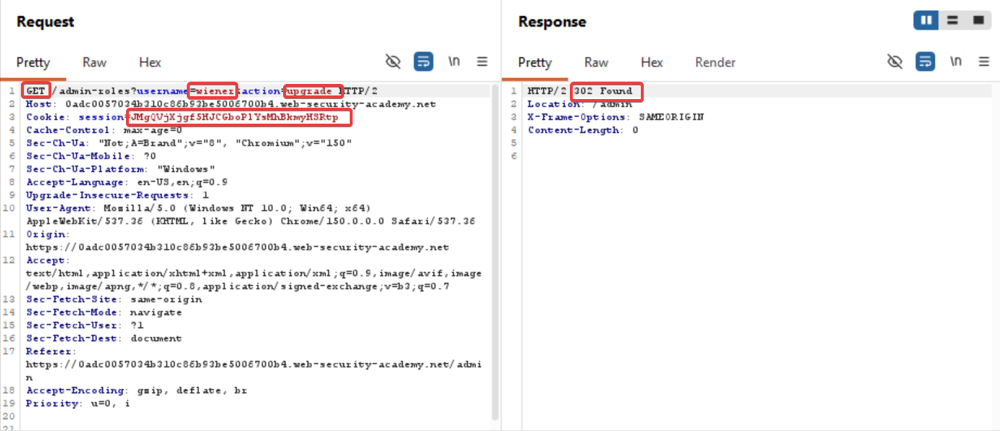
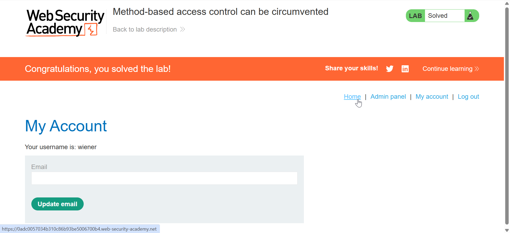

##### Vertical Privilege escalation
Lab 6:
Method-based access control

So I captured the promotion request of user Carlos 
And login request of user Wiener

And swapped the cookie id of Carlos with Wiener

It shows unauthorized, since the user name at the bottom of the request is still Carlos

Now we try to change the user name

We still get 401 unauthorized

Now since the lab contains HTTP method based access control flaw, we'll try to change the method parameter in the request

Which means that the request allows methods to be ...
Right click and change the method and change the username to wiener

Copying the request link and opening it in a new tab gives

#### Learnings:
This is a classic **HTTP verb/method tampering** observation, and it tells you a few important things about how the backend is built:

**1. The method isn't strictly validated before the request reaches application logic**

If the server properly enforced allowed methods, sending an invalid one like `POSTX` should produce something like `404 Not Found` or `405 Method Not Allowed` _before_ any parameter parsing happens. Instead, you got "missing parameter" — meaning the request passed through routing and reached the code that reads/validates input parameters. The method string itself was essentially ignored past that point.

**2. The backend likely parses the body regardless of the exact method name**

Many frameworks (PHP, older Java servlets, some Node middleware) populate parameters from the request body as long as a body/content-type is present — they don't always gate that parsing strictly on `method === "POST"`. So the app still tried to read parameters, found none (or malformed ones), and threw the same validation error it would for a normal POST with missing fields.

**3. This is significant for security testing because:**

- **WAF/filter bypass potential**: Many WAFs, reverse proxies, or security middleware apply inspection rules (SQLi/XSS filters, rate limiting, auth checks) _only_ to recognized methods like `GET`/`POST`. A non-standard method can slip past those filters while the backend still processes it as if it were a normal request — meaning your actual payload might reach vulnerable code without being inspected.
- **Access control bypass potential**: Some authorization middleware is also method-specific (e.g., "block POST to /admin unless authenticated" but no rule for arbitrary methods). If the backend still executes the handler for `POSTX`, you may have found a way to reach a protected action.
- **Confirms the endpoint exists and is "live"** — it's not returning a generic 404, so you've fingerprinted a real parameter-driven handler.

**Fix:** **Don't rely on the HTTP method or URL route to provide the only security check; the actual sensitive operation should verify authorization itself, and invalid HTTP methods should be rejected instead of being allowed to reach other application logic.**

For your PortSwigger lab, the vulnerability happens because **the security check and the actual privileged action are separated**, allowing an unusual method to potentially slip past the check.