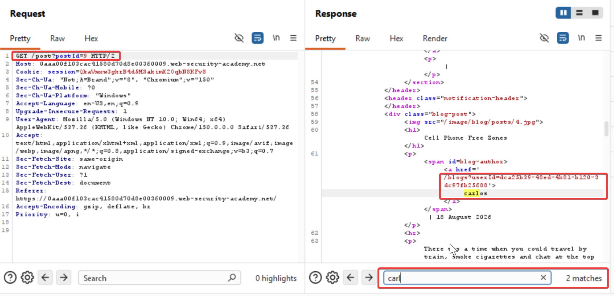
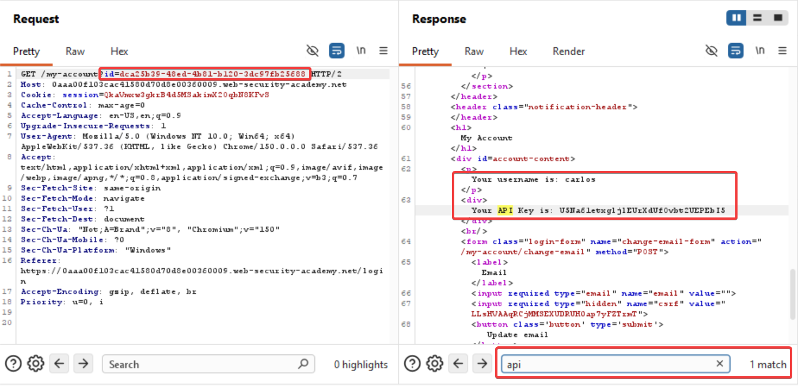

#### User ID controlled by request parameter, with unpredictable user IDs

Steps to reproduce:

Login using the given credentials wiener:peter 
Crawl the home page blogs for user carlos, he may have commented somewhere
After checking out every comment on all the blogs I find out that carlos is the blog writer not one of the commentators
So I capture the request of one of the blogs and send it to repeater and get the user id of carlos in the response

Since I got the user id of carlos, now I'll try to login as carlos and get his api key
This can be done by swapping wiener's userid with carlos' and just send it

