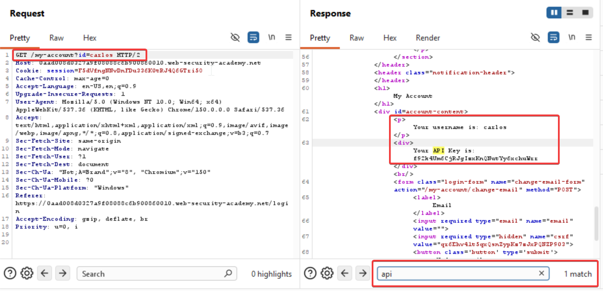

In some cases, an application does detect when the user is not permitted to access the resource, and returns a redirect to the login page. However, the response containing the redirect might still include some sensitive data belonging to the targeted user, so the attack is still successful.

Steps to reproduce:

Captured my login request as wiener and chaged the username to carlos in repeater and send it 

