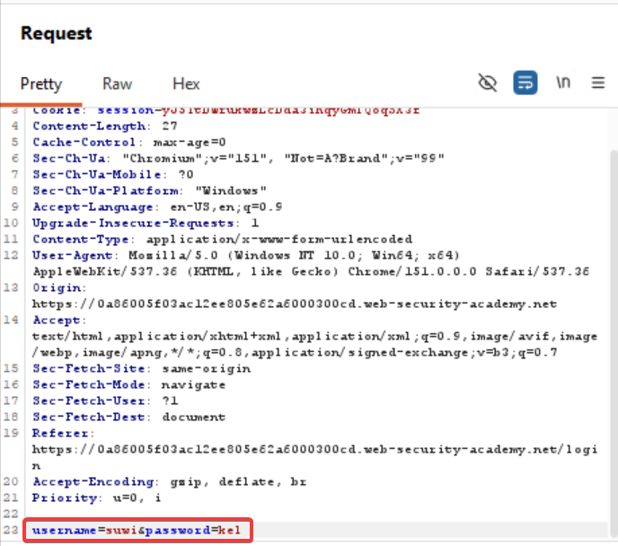
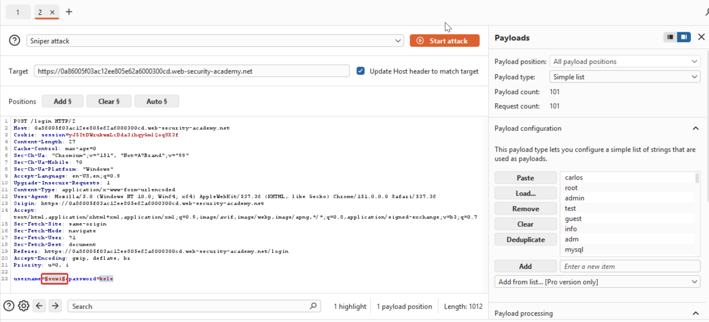
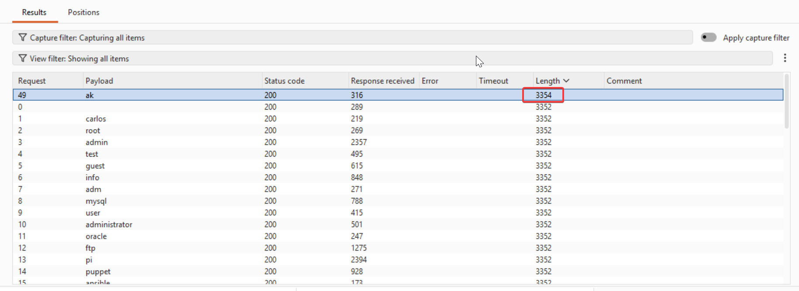
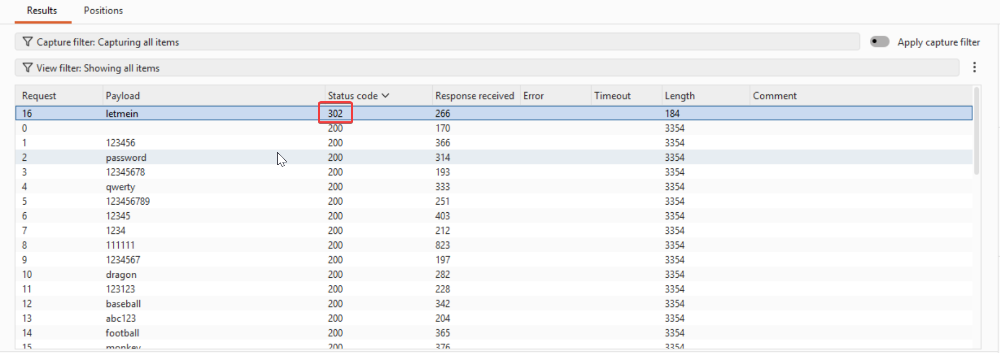
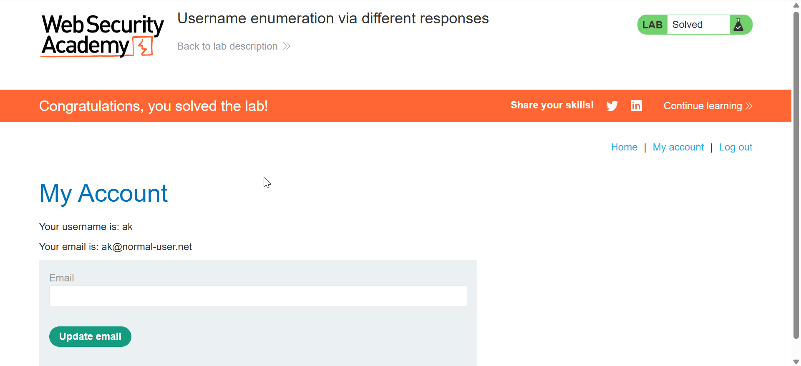

# Username enumeration via different responses

Steps to reproduce:

First we capture the login request using an id that never exists and send it to repeater



Now to brute force the id and password, we send the above request to intruder and set the payload to `simple list`  and enter the list of usernames provided for the lab 



Now while the payload is getting executed, we need to look for a specific username where the length differs than the normal length



Here we've got the username `ak`, now we'll brute force the password.
Instead of looking for a different length, here we look for a different status code



Now we login using the credentials and boom 
Lab solved !!!



#### Learnings:

**When testing usernames → we looked at response length**
We sent many possible usernames while keeping the password fixed.

For example:

|Username|Response|Length|
|---|---|--:|
|`admin`|Invalid username|3201|
|`carlos`|Invalid username|3201|
|`wiener`|Invalid username|**3220**|
|`david`|Invalid username|3201|

The application gives a **slightly different response** when the username exists.

**When testing the password → we looked at status code**
Once you found a valid username, you kept that username fixed and brute-forced the password.

Now the responses looked more like:

|Password|Status|Length|
|---|--:|--:|
|`123456`|200|3201|
|`password`|200|3201|
|`qwerty`|200|3201|
|**correct password**|**302**|0|

Here, the application responds differently when authentication succeeds.

For example:
```http
HTTP/2 200 OK
```
means:
> Login failed → stay on login page.

Whereas:
```http
HTTP/2 302 Found
Location: /my-account
```
means:
> Login succeeded → redirect the user to their account.

Therefore, **status code** is the easiest way to identify the correct password.
