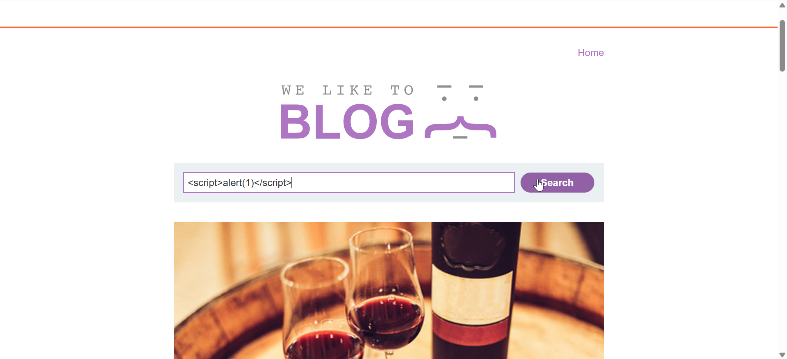
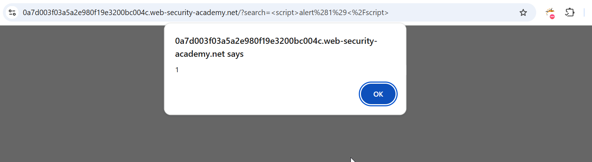

# Reflected XSS into HTML context with nothing encoded

Steps to reproduce:
Just paste this script 
 

P.S: You can confirm most kinds of XSS vulnerability by injecting a payload that causes your own browser to execute some arbitrary JavaScript. It's long been common practice to use the `alert()` function for this purpose because it's short, harmless, and pretty hard to miss when it's successfully called. In fact, you solve the majority of our XSS labs by invoking `alert()` in a simulated victim's browser.

Unfortunately, there's a slight hitch if you use Chrome. From version 92 onward (July 20th, 2021), cross-origin iframes are prevented from calling `alert()`. As these are used to construct some of the more advanced XSS attacks, you'll sometimes need to use an alternative PoC payload. In this scenario, we recommend the `print()` function. If you're interested in learning more about this change and why we like `print()`, [check out our blog post](https://portswigger.net/research/alert-is-dead-long-live-print) on the subject.

As the simulated victim in our labs uses Chrome, we've amended the affected labs so that they can also be solved using `print()`. We've indicated this in the instructions wherever relevant.

