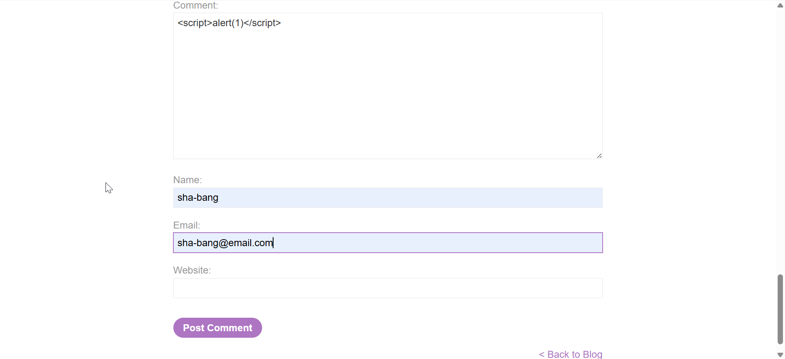
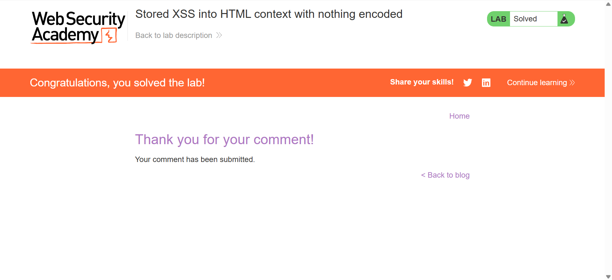

# Stored XSS into HTML context with nothing encoded

Similar to lab 1 but since this is a stored xss lab we need to enter the payload 
```
<script>alert(1)</script>
```
into the comment, where the input by the user is saved into the server it self




**P.S:** Note how the payload isn't executed on the client side immediately as it did in lab 1. This is in stored xss the payload is stored in the database and when another user tries access that page (in this case the comment page), it directly executes.

When you submit a stored XSS payload, **it doesn't necessarily execute immediately when you submit it**. It executes when the stored value is **later rendered in a vulnerable page/context**.

### Example

Suppose you enter:

```html
<script>alert(1)</script>
```

into a comment field.

You click **Submit**.

At this point:

```text
Your browser
    ↓
POST /comment
    ↓
Server
    ↓
Database
```

The payload is stored.

You might see:

```text
Comment submitted successfully
```

and **no alert**.

That's normal.

---

### Later, someone opens the comments page

The application retrieves your comment:

```text
Database
   ↓
<script>alert(1)</script>
   ↓
Server generates HTML
   ↓
Victim's browser
```

If the application renders it unsafely:

```html
<div class="comment">
    <script>alert(1)</script>
</div>
```

**Now the browser executes it**, and the alert appears.

---

## But what if you revisit the page and still don't see the alert?

Then several things could be happening.

### 1. Your input is being encoded

The server might turn:

```html
<script>alert(1)</script>
```

into:

```html
&lt;script&gt;alert(1)&lt;/script&gt;
```

The browser displays it as text:

```text
<script>alert(1)</script>
```

but **doesn't execute it**.

That's because the browser sees it as text rather than an actual `<script>` element.

---

### 2. Your input is being sanitized

The application might remove dangerous parts:

```text
<script>alert(1)</script>
```

becomes something like:

```text
alert(1)
```

or the entire input could be removed.

Again, no execution.

---

### 3. You're looking at the wrong page

This is **very common in stored XSS testing**.

The field might be stored in the database but only displayed somewhere else.

For example:

```text
Submit comment
     ↓
Stored in DB
     ↓
NOT rendered on current page
     ↓
Admin panel displays comments
     ↓
XSS executes when admin views it
```

So you need to identify the **sink/page where the stored value is actually rendered**.

---

### 4. The payload isn't valid for that context

Suppose your input ends up here:

```html
<input value="YOUR_INPUT">
```

Trying:

```html
<script>alert(1)</script>
```

may not work because you're inside an HTML attribute rather than normal HTML body content.

The context matters.

---

## One more important thing

You said:

> "the payload executes but doesn't show the reflected output or alert"

If the JavaScript **actually executes**, you should see its observable effect unless something prevents the effect (for example, browser/security controls or the specific payload).

Also, **stored XSS doesn't have "reflected output" in the same sense as reflected XSS**.

The difference is:

### Reflected XSS

```text
Payload
   ↓
Request
   ↓
Server
   ↓
Immediate response
   ↓
Browser executes
```

### Stored XSS

```text
Payload
   ↓
Request
   ↓
Server
   ↓
Database
   ↓
Later request
   ↓
Server retrieves payload
   ↓
Browser executes
```

So when practicing in **PortSwigger**, pay attention to **where the payload is stored and where it is subsequently rendered**. That's one of the main things you need to understand to distinguish stored XSS from reflected XSS.